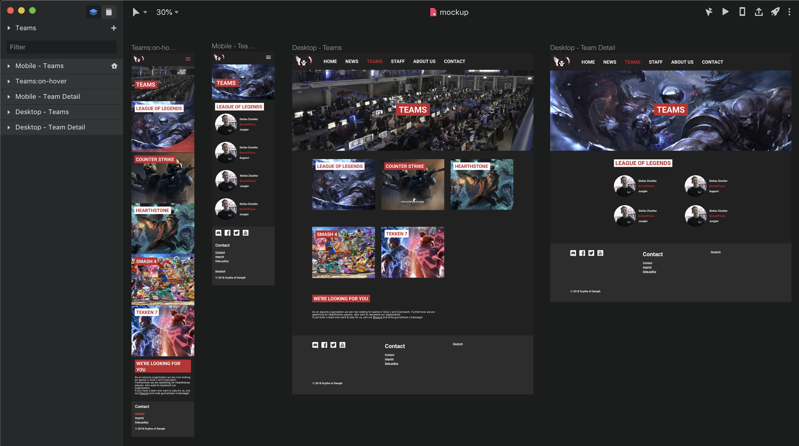

# Scythe of Seraph Application

---

## Projekt-Idee

- Neue Website für Scythe of Seraph
- Beinhaltet:
  - Teams
  - News
  - Resultate
  - Infos über Organisation

----

## Sitemap Seite


----

## Design

- Mockup mit Invision Studio gemacht
- Breakpoints für Mobile und Desktop



---

## Technologien

----

### Angular 7

- **Komponenten- / Modulsystem**
  - Gekapseltes styling per Komponent
  - Einfach wiederverwendbare Komponenten

----

#### Komponenten- / Modulsystem

**Komponentenstruktur**
```
- app.component
  - app.component.scss // SCSS stylesheet
  - app.component.html // HTML-Template
  - app.component.ts // Typescript
```

----

#### Komponenten- / Modulsystem

**Modulstruktur**
```
- app.module
  - app.component
  - home.component
  - teams.module
    - teams-overview.component
    - teams-preview.component
    - teams-detail.component
```

Notes: Lazy loading

----

### Angular - Our Experience
- Projektstruktur
- Lazy Loaded Modules
- Material CDK: Drag & Drop
- Material CDK: Material-Native Select

Notes: Wir konnten an seperaten Teilen der App arbeiten ohne grosse merge conflicts zu erhalten

Lazy Loaded Modules führen dazu dass ein normaler Besucher z.B. das Admin Panel nie lädt   -> App wird kleiner

----

### App ladegrösse:

| Datei        | Grösse  |
| ------------ | ------- |
| index.html   |   931 B |
| styles.css   | 10.8 KB |
| runtime.js   |  1.6 KB |
| polyfills.js |   32 KB |
| main.js      |  352 KB |

----

### Firebase
- Platform as a service (PAAS)
- Für kleinere Projekte kostenfrei
- JavaScript SDK

----

#### Firebase - Features
- Authentication
- Database (Firestore & Realtime DB)
- Hosting
- Push Notifications
- Analytics
- Functions

Notes: Authentication Providers (Google, Github, Email, ...)  
Functions: cloud scaled node.js API endpoints

----

#### Firebase - Firestore
- Database
- NoSQL Document Storage
- Live Change Updates

---

## Styling

- Whether to use a css framework or not
- Layout
- Advantages of scss
- Responsive Design